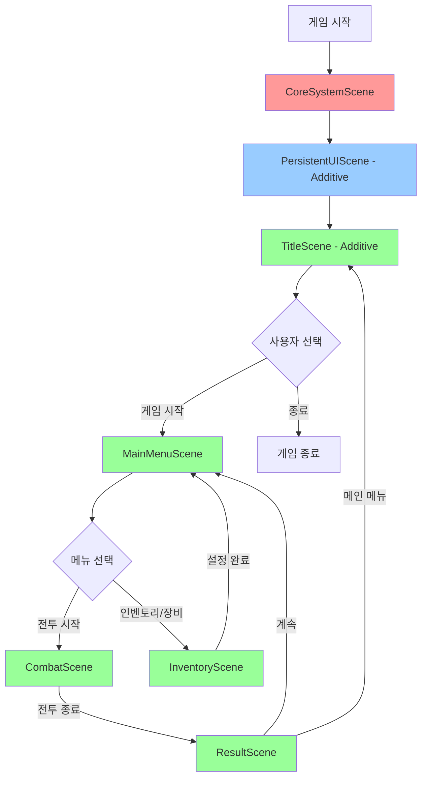

# Scene 계층 구조 설계

**작성일**: 2025-11-03  
**상태**: 설계 완료 (구현 대기)  
**목적**: 프로토타입에서 실제 게임으로 전환하기 위한 Scene 구조 설계

---

## 📋 목차

1. [Scene 구조 개요](#scene-구조-개요)
2. [Scene 계층 다이어그램](#scene-계층-다이어그램)
3. [Scene 목록 및 역할](#scene-목록-및-역할)
4. [Scene별 상세 설명](#scene별-상세-설명)
5. [PersistentUI 기술 상세](#persistentui-기술-상세)
6. [매니저 아키텍처 및 데이터 흐름](#매니저-아키텍처-및-데이터-흐름)
7. [Scene 전환 흐름](#scene-전환-흐름)
8. [구현 우선순위](#구현-우선순위)

---

## Scene 구조 개요

### 🎯 설계 목표

| 목표 | 설명 |
|------|------|
| **영속성 관리** | 게임 전반에서 유지되어야 하는 시스템과 데이터 분리 |
| **메모리 효율성** | 필요한 Scene만 로드/언로드하여 리소스 최적화 |
| **확장성** | 새로운 컨텐츠 추가 시 기존 구조 수정 최소화 |
| **명확한 책임** | 각 Scene의 역할과 생명주기를 명확히 정의 |

### 🏗️ 3-Layer 구조

```
┌──────────────────────────────────────────┐
│  Layer 1: Core Systems (영속 레이어)      │  ← 항상 로드, 절대 언로드 안됨
│  - CoreSystemScene                       │
└──────────────────────────────────────────┘
         ↓ 관리 및 제어
┌──────────────────────────────────────────┐
│  Layer 2: Persistent UI (공통 UI 레이어)  │  ← 게임 중 대부분 유지
│  - PersistentUIScene                     │
└──────────────────────────────────────────┘
         ↓ UI 제공
┌──────────────────────────────────────────┐
│  Layer 3: Content (컨텐츠 레이어)         │  ← 필요시 동적 로드/언로드
│  - TitleScene                            │
│  - MainMenuScene                         │
│  - CombatScene                           │
│  - InventoryScene                        │
│  - ResultScene                           │
│  - (확장용 Scene들...)                   │
└──────────────────────────────────────────┘
```

---

## Scene 계층 다이어그램

### Scene 로딩 관계도



**범례:**
- 🔴 빨강: Core Systems (항상 유지)
- 🔵 파랑: Persistent UI (대부분 유지)
- 🟢 초록: Content Scenes (동적 로드/언로드)

### Scene 메모리 상태 타임라인

```
시간 →
━━━━━━━━━━━━━━━━━━━━━━━━━━━━━━━━━━━━━━━━━━━━━
CoreSystemScene      [████████████████████████]  ← 시작~종료까지
PersistentUIScene    [████████████████████████]  ← 시작~종료까지
TitleScene           [████]                      ← 타이틀만
MainMenuScene             [████]    [████]       ← 메뉴 진입 시
CombatScene                    [████]            ← 전투 중
ResultScene                        [██]          ← 결과 화면
InventoryScene           [██]                    ← 인벤토리 열었을 때
━━━━━━━━━━━━━━━━━━━━━━━━━━━━━━━━━━━━━━━━━━━━━
```

---

## Scene 목록 및 역할

### Layer 1: Core Systems (영속 레이어)

| Scene 명 | 로드 방식 | 생명주기 | 주요 역할 |
|---------|----------|---------|----------|
| **CoreSystemScene** | Single | 게임 시작~종료 | 싱글톤 매니저들, 데이터 관리, Scene 전환 제어 |

### Layer 2: Persistent UI (공통 UI 레이어)

| Scene 명 | 로드 방식 | 생명주기 | 주요 역할 |
|---------|----------|---------|----------|
| **PersistentUIScene** | Additive | 게임 시작~종료 | 공통 UI (로딩 화면, 페이드, 시스템 메시지 등) |

### Layer 3: Content (컨텐츠 레이어)

| Scene 명 | 로드 방식 | 생명주기 | 주요 역할 |
|---------|----------|---------|----------|
| **TitleScene** | Additive | 타이틀 화면 표시 중 | 게임 시작 화면, 타이틀 UI |
| **MainMenuScene** | Additive | 메인 메뉴 중 | 캐릭터 준비, 게임 모드 선택 |
| **CombatScene** | Additive | 전투 중 | 전투 시스템, 전투 UI, 전투 환경 |
| **InventoryScene** | Additive | 인벤토리/장비 관리 중 | 인벤토리 UI, 장비 설정 UI, 검술 설정 |
| **ResultScene** | Additive | 전투 결과 표시 중 | 전투 결과 UI, 보상 획득 |
| **TutorialScene** | Additive | 튜토리얼 중 (향후) | 튜토리얼 전용 환경 및 UI |
| **BossEncounterScene** | Additive | 보스전 중 (향후) | 특수 보스전 환경 |

---

## Scene별 상세 설명

### 1️⃣ CoreSystemScene

**목적**: 게임 전체를 관통하는 핵심 시스템 관리

#### 포함 GameObject/Component

| GameObject | Component | 역할 |
|------------|-----------|------|
| `GameManager` | GameManager | 게임 전체 상태 관리 (일시정지, 게임 오버 등) |
| `SceneTransitionManager` 🆕 | SceneTransitionManager | Scene 로드/언로드 제어, 전환 효과 |
| `PlayerCharacterManager` 🆕 | PlayerCharacterManager | 플레이어 진행도 관리 (레벨, 골드, 인벤토리, 장비) |
| `CharacterDatabase` 🆕 | CharacterDatabase | 캐릭터 템플릿 관리 (Player, Enemy, NPC 데이터) |
| `ItemDatabase` | ItemDatabase | 아이템 데이터베이스 |
| `ActionCommandDatabase` | ActionCommandDatabase | 검술 데이터베이스 |
| `InputManager` | GameInputManager | 입력 시스템 (현재 InputSystem 기반) |
| `AudioManager` | AudioManager | 배경음악, 효과음 관리 |
| `SaveLoadManager` | SaveLoadManager | 저장/로드 시스템 |

#### 특징

- ✅ **DontDestroyOnLoad**: 모든 GameObject에 적용
- ✅ **싱글톤 패턴**: 전역 접근 가능
- ✅ **Scene 독립적**: 어떤 Content Scene에서도 접근 가능
- ⚠️ **절대 언로드 금지**: 게임 시작부터 종료까지 유지

#### Scene 파일 구성 예시

```
CoreSystemScene (Hierarchy)
├── [Managers]
│   ├── GameManager
│   ├── SceneTransitionManager 🆕
│   ├── PlayerCharacterManager 🆕
│   ├── CharacterDatabase 🆕
│   ├── ItemDatabase
│   ├── ActionCommandDatabase
│   ├── InputManager (GameInputManager)
│   ├── AudioManager
│   └── SaveLoadManager
└── [EventSystem]
    └── EventSystem (UI 입력용)
```

---

### 2️⃣ PersistentUIScene

**목적**: 모든 Scene에서 공통으로 사용하는 UI 요소 제공

#### 포함 GameObject/Component

| GameObject | Component | 역할 |
|------------|-----------|------|
| `LoadingCanvas` | Canvas, LoadingUI | 로딩 화면, 진행 바 |
| `FadeCanvas` | Canvas, FadeController | Scene 전환 페이드 효과 |
| `SystemMessageCanvas` | Canvas, SystemMessageUI | 시스템 메시지, 알림 팝업 |
| `TooltipCanvas` | Canvas, TooltipUI | 툴팁 표시 (아이템, 스킬 등) |

#### 특징

- ✅ **Additive 로드**: CoreSystemScene 다음 자동 로드
- ✅ **최상위 렌더링**: Canvas Sort Order 높게 설정
- ✅ **게임 내내 유지**: 일반적으로 언로드하지 않음
- ✅ **전역 UI**: 어떤 Scene에서든 호출 가능

#### Scene 파일 구성 예시

```
PersistentUIScene (Hierarchy)
├── LoadingCanvas (Sort Order: 1000)
│   ├── LoadingPanel
│   ├── ProgressBar
│   └── LoadingText
├── FadeCanvas (Sort Order: 900)
│   └── FadeImage (검은색 전체 화면)
├── SystemMessageCanvas (Sort Order: 800)
│   ├── MessagePanel
│   └── MessageText
└── TooltipCanvas (Sort Order: 700)
    └── TooltipPanel
```

---

### 3️⃣ TitleScene

**목적**: 게임 시작 화면

#### 포함 요소

| 요소 | 설명 |
|------|------|
| **UI** | 타이틀 로고, "게임 시작" 버튼, "종료" 버튼, 버전 정보 |
| **배경** | 타이틀 배경 이미지 또는 애니메이션 |
| **오디오** | 타이틀 BGM 재생 트리거 |

#### 생명주기

```
게임 시작 → TitleScene 로드
   ↓
[게임 시작] 버튼 클릭
   ↓
TitleScene 언로드 → MainMenuScene 로드
```

---

### 4️⃣ MainMenuScene

**목적**: 게임 메인 메뉴, 캐릭터 준비 및 모드 선택

#### 포함 요소

| 요소 | 설명 |
|------|------|
| **메뉴 UI** | "전투 시작", "인벤토리/장비", "설정", "종료" 버튼 |
| **캐릭터 정보** | 현재 장착 장비, 스탯 요약 표시 |
| **배경** | 메인 메뉴 배경 |

#### 생명주기

```
MainMenuScene 로드
   ↓
사용자 선택:
   - "전투 시작" → MainMenu 언로드 → CombatScene 로드
   - "인벤토리/장비" → InventoryScene Additive 로드 (MainMenu 유지)
   - "메인 메뉴" → MainMenu 언로드 → TitleScene 로드
```

#### 특징

- ✅ InventoryScene과 **동시 로드 가능** (Additive)
- ✅ 메뉴에서 인벤토리 열면 InventoryScene만 추가 로드

---

### 5️⃣ CombatScene

**목적**: 전투 시스템 실행 (현재 ProtoType.unity의 내용 이관)

#### 포함 요소

| 카테고리 | 요소 |
|---------|------|
| **전투 매니저** | CombatManager, CombatCharacterManager 🆕, CombatStatusDisplay |
| **캐릭터** | PlayerController, EnemyController |
| **입력 핸들러** | AttackerInputHandler, DefenderInputHandler |
| **전투 UI** | 턴 정보, 커맨드 선택 UI, 타이밍 입력 UI, 전투 로그 |
| **환경** | 전투 배경, 조명, 카메라 |
| **애니메이션** | Spine 애니메이션 (캐릭터, 적) |
| **발사체** | ProjectileManager |

#### 생명주기

```
CombatScene 로드
   ↓
CombatManager.StartBattle() 호출
   ↓
전투 진행 (턴제)
   ↓
전투 종료
   ↓
CombatScene 언로드 → ResultScene 로드
```

#### 특징

- ✅ **독립 실행**: 전투에 필요한 모든 요소 포함
- ✅ **데이터 연동**: PlayerCharacterManager & CharacterDatabase에서 캐릭터 데이터 가져옴
- ✅ **전투 결과 저장**: 전투 종료 시 결과를 PlayerCharacterManager에 동기화
- ✅ **Scene 전용**: CombatCharacterManager는 CombatScene에만 존재 (DontDestroyOnLoad ❌)

---

### 6️⃣ InventoryScene

**목적**: 인벤토리 및 장비/검술 설정 (현재 InventoryUI Prefab 이관)

#### 포함 요소

| 카테고리 | 요소 |
|---------|------|
| **인벤토리 UI** | InventoryUI (아이템 그리드, 필터, 정렬) |
| **장비 설정** | 장비 슬롯, 장착/해제 UI |
| **검술 설정** | ActionCommand 선택, SwordArtStyle 설정 |
| **아이템 상세** | 아이템 정보 패널, 스탯 비교 |

#### 생명주기

```
InventoryScene Additive 로드 (MainMenuScene 유지)
   ↓
사용자 아이템 관리, 장비 설정
   ↓
"닫기" 또는 "완료" 버튼
   ↓
InventoryScene 언로드 (MainMenuScene 복귀)
```

#### 특징

- ✅ **오버레이 방식**: MainMenuScene 위에 겹쳐서 표시
- ✅ **Additive 로드**: MainMenuScene을 언로드하지 않음
- ✅ **데이터 연동**: DataManager의 인벤토리 데이터 사용

---

### 7️⃣ ResultScene

**목적**: 전투 결과 표시 및 보상 획득

#### 포함 요소

| 요소 | 설명 |
|------|------|
| **결과 UI** | 승리/패배 표시, 획득 경험치, 골드, 아이템 |
| **통계** | 턴 수, Perfect 입력 횟수, 피해량 등 |
| **버튼** | "계속", "메인 메뉴" |

#### 생명주기

```
ResultScene 로드
   ↓
전투 결과 표시
   ↓
사용자 선택:
   - "계속" → ResultScene 언로드 → MainMenuScene 로드
   - "메인 메뉴" → ResultScene 언로드 → TitleScene 로드
```

---

### 8️⃣ 확장용 Scene (향후)

| Scene 명 | 용도 | 우선순위 |
|---------|------|---------|
| **TutorialScene** | 튜토리얼 전용 환경 | 중 |
| **BossEncounterScene** | 특수 보스전 (연출 강화) | 하 |
| **StoryScene** | 스토리 연출 Scene | 하 |
| **WorldMapScene** | 월드맵 (지역 선택) | 중 |

---

## PersistentUI 기술 상세

### 🔍 PersistentUI란?

**PersistentUI**는 게임 전반에서 **항상 사용 가능한 공통 UI 요소들을 별도 Scene으로 분리**하여, **다른 Content Scene과 독립적으로 관리**하는 패턴입니다.

### 왜 필요한가?

#### ❌ PersistentUI 없이 구현할 경우의 문제점

```
CombatScene에 로딩 화면 UI 포함
   ↓
MainMenuScene에도 로딩 화면 UI 포함
   ↓
ResultScene에도 로딩 화면 UI 포함
   ...
```

**문제:**
- 🔴 **중복 작업**: 모든 Scene에 동일한 UI Prefab 배치
- 🔴 **유지보수 어려움**: UI 수정 시 모든 Scene 업데이트 필요
- 🔴 **메모리 낭비**: 동일한 UI 리소스가 여러 Scene에 중복 로드
- 🔴 **일관성 문제**: Scene마다 UI가 미묘하게 다를 수 있음

#### ✅ PersistentUI로 해결

```
PersistentUIScene (한 번만 로드, 항상 유지)
   ├── 로딩 화면
   ├── 페이드 효과
   ├── 시스템 메시지
   └── 툴팁

모든 Content Scene에서 위 UI를 공유
```

**장점:**
- ✅ **중앙 관리**: UI를 한 곳에서만 수정
- ✅ **메모리 효율**: UI 리소스가 한 번만 로드됨
- ✅ **일관성 보장**: 모든 Scene에서 동일한 UI 사용
- ✅ **Scene 간 UI 유지**: Scene 전환 시 UI가 끊기지 않음

### 기술적 동작 방식

#### 1. Scene 로딩 구조

```
[게임 시작 시]
Step 1: CoreSystemScene 로드 (Single)
   ↓
Step 2: PersistentUIScene Additive 로드
   ↓
Step 3: TitleScene Additive 로드

━━━━━━━━━━━━━━━━━━━━━━━━━━━━━━
메모리 상태:
┌─────────────────────────┐
│ CoreSystemScene         │ ← DontDestroyOnLoad
├─────────────────────────┤
│ PersistentUIScene       │ ← Additive, 항상 유지
├─────────────────────────┤
│ TitleScene              │ ← Additive, 필요시 언로드
└─────────────────────────┘
```

#### 2. Scene 전환 시 동작

```
[전환 전]
CoreSystemScene    [로드됨]
PersistentUIScene  [로드됨]  ← 유지
TitleScene         [로드됨]

   ↓ Scene 전환 (TitleScene → MainMenuScene)

[전환 중]
1. FadeController.FadeOut() 호출
   (PersistentUIScene의 FadeCanvas가 화면을 어둡게)
2. TitleScene 언로드
3. MainMenuScene Additive 로드
4. FadeController.FadeIn() 호출

[전환 후]
CoreSystemScene    [로드됨]
PersistentUIScene  [로드됨]  ← 계속 유지! (언로드 안됨)
MainMenuScene      [로드됨]
```

**핵심**: PersistentUIScene은 **절대 언로드되지 않으므로**, 그 안의 UI 요소들이 **Scene 전환과 무관하게 항상 사용 가능**합니다.

#### 3. Canvas 렌더링 순서

PersistentUI의 Canvas들은 **Sort Order**를 높게 설정하여 **모든 Content Scene의 UI보다 위에 렌더링**됩니다.

```
렌더링 순서 (뒤→앞):

Scene별 UI:
  CombatScene UI       (Sort Order: 0~99)
  MainMenuScene UI     (Sort Order: 0~99)
  ResultScene UI       (Sort Order: 0~99)

PersistentUI:
  TooltipCanvas        (Sort Order: 700)  ← 최상위
  SystemMessageCanvas  (Sort Order: 800)
  FadeCanvas           (Sort Order: 900)
  LoadingCanvas        (Sort Order: 1000) ← 최최상위
```

**결과**: 
- ✅ 로딩 화면이 **모든 UI 위에** 표시됨
- ✅ 페이드 효과가 **전체 화면을 덮음**
- ✅ 시스템 메시지가 **어떤 UI 위에도** 표시됨

#### 4. 코드 예시 (최소한으로)

**Scene 전환 시 PersistentUI 활용:**

```csharp
// SceneTransitionManager.cs (CoreSystemScene)
public class SceneTransitionManager : MonoBehaviour
{
    public void TransitionToScene(string sceneName)
    {
        StartCoroutine(TransitionCoroutine(sceneName));
    }
    
    private IEnumerator TransitionCoroutine(string targetScene)
    {
        // 1. PersistentUI의 FadeController 호출
        FadeController.Instance.FadeOut();
        yield return new WaitForSeconds(0.5f);
        
        // 2. 현재 Content Scene 언로드
        yield return SceneManager.UnloadSceneAsync(currentScene);
        
        // 3. 새 Content Scene 로드
        yield return SceneManager.LoadSceneAsync(targetScene, LoadSceneMode.Additive);
        
        // 4. PersistentUI의 FadeController 호출
        FadeController.Instance.FadeIn();
        
        currentScene = targetScene;
    }
}
```

**핵심**: `FadeController`는 PersistentUIScene에 있으므로, **Scene이 언로드/로드되어도 계속 존재**하며, 언제든 호출 가능합니다.

### PersistentUI vs DontDestroyOnLoad 비교

| 특징 | PersistentUI (Scene) | DontDestroyOnLoad (Object) |
|------|---------------------|---------------------------|
| **관리 단위** | Scene 단위 | GameObject 단위 |
| **에디터 편집** | Scene에서 직접 편집 가능 ✅ | 런타임에만 생성되어 편집 어려움 ❌ |
| **팀 협업** | Scene 파일로 버전 관리 쉬움 ✅ | Prefab + 코드 조합 필요 |
| **Canvas 구성** | 여러 Canvas를 Scene에 배치 ✅ | Canvas를 코드로 생성/관리 |
| **추천 용도** | **공통 UI** | **싱글톤 매니저** |

**결론**: UI는 PersistentUI Scene으로, 매니저는 DontDestroyOnLoad로 관리하는 것이 이상적입니다.

---

## 매니저 아키텍처 및 데이터 흐름

### 🎯 설계 원칙

#### 핵심 원칙 3가지

| 원칙 | 설명 |
|------|------|
| **영속 vs 임시 분리** | 영속 데이터(Player 진행도)와 임시 데이터(전투 인스턴스)를 명확히 분리 |
| **템플릿 vs 인스턴스 분리** | 캐릭터 템플릿(ScriptableObject)과 런타임 인스턴스를 분리 관리 |
| **Scene 독립성** | Content Scene(CombatScene)이 Core Scene 매니저에 과도하게 의존하지 않도록 설계 |

#### 기존 CharacterManager의 문제점

```
CharacterManager (기존 - 역할 혼재)
├── PlayerCharacter (영속 데이터) ← 게임 내내 유지
└── EnemyCharacter (임시 데이터)  ← 전투마다 교체
    ⚠️ 문제: 생명주기가 다른 데이터를 하나의 매니저가 관리
```

### 🏗️ 분리된 매니저 구조

#### 3-Manager 아키텍처

```
┌─────────────────────────────────────────────────────────┐
│ Layer 1: 플레이어 영속 데이터 (CoreSystemScene)          │
│ - PlayerCharacterManager                                │
│   역할: 플레이어 진행도 (레벨, 골드, 인벤토리, 장비)       │
│   생명주기: 게임 시작 ~ 종료                              │
│   저장/로드: ✅ 저장 대상                                 │
└─────────────────────────────────────────────────────────┘
         ↓ Player 인스턴스 생성 요청
┌─────────────────────────────────────────────────────────┐
│ Layer 2: 캐릭터 템플릿 (CoreSystemScene)                 │
│ - CharacterDatabase                                     │
│   역할: 모든 캐릭터의 초기 템플릿(CharacterData) 보관     │
│   생명주기: 게임 시작 ~ 종료                              │
│   저장/로드: ❌ ScriptableObject 에셋 로드만              │
└─────────────────────────────────────────────────────────┘
         ↓ Enemy 인스턴스 생성 요청
┌─────────────────────────────────────────────────────────┐
│ Layer 3: 전투 컨텍스트 (CombatScene)                     │
│ - CombatCharacterManager                                │
│   역할: 현재 전투 중인 양측 Character 인스턴스 관리        │
│   생명주기: 전투 시작 ~ 전투 종료                         │
│   저장/로드: ❌ 임시 데이터                               │
└─────────────────────────────────────────────────────────┘
```

### 📋 매니저별 상세

#### 1️⃣ PlayerCharacterManager

**소속:** CoreSystemScene (DontDestroyOnLoad)

**주요 데이터:**
```csharp
// 진행도
public int Level { get; private set; }
public int Experience { get; private set; }
public int Gold { get; private set; }

// 영속 데이터
public CharacterInventory Inventory { get; private set; }
public EquipmentState Equipment { get; private set; }
public ActionCommandState Actions { get; private set; }
```

**주요 메서드:**
```csharp
// 전투용 인스턴스 생성
public PlayerCharacter CreatePlayerCharacterForBattle()

// 전투 후 상태 동기화
public void SyncPlayerStateAfterBattle(PlayerCharacter battleInstance)

// 진행도 관리
public void AddExperience(int amount)
public void AddGold(int amount)
```

**생명주기:**
- ✅ 게임 시작 시 생성 (또는 저장 파일 로드)
- ✅ 게임 종료 시까지 유지
- ✅ Scene 전환 시에도 파괴되지 않음

---

#### 2️⃣ CharacterDatabase

**소속:** CoreSystemScene (DontDestroyOnLoad)

**주요 데이터:**
```csharp
[SerializeField] private CharacterData playerTemplateAsset;
[SerializeField] private List<CharacterData> enemyTemplateAssets;

private Dictionary<string, CharacterData> characterRegistry;
```

**주요 메서드:**
```csharp
// 템플릿 조회
public CharacterData GetPlayerTemplate()
public CharacterData GetCharacterTemplate(string characterId)

// 인스턴스 생성
public EnemyCharacter CreateEnemy(string enemyId)
public NPCCharacter CreateNPC(string npcId) // 향후
```

**생명주기:**
- ✅ 게임 시작 시 CharacterData 에셋 로드
- ✅ 게임 종료 시까지 유지
- ✅ 템플릿 데이터는 변경되지 않음 (읽기 전용)

---

#### 3️⃣ CombatCharacterManager

**소속:** CombatScene (Scene 전용, DontDestroyOnLoad ❌)

**주요 데이터:**
```csharp
public PlayerCharacter PlayerCharacter { get; private set; }
public List<EnemyCharacter> EnemyCharacters { get; private set; }
public EnemyCharacter CurrentEnemy => EnemyCharacters?[0];
```

**주요 메서드:**
```csharp
// 전투 초기화
public void InitializeBattle(string enemyId)
public void InitializeBattle(List<string> enemyIds) // 다중 적

// 전투 종료
public void FinalizeBattle(BattleResult result)

// Controller 연결
public void ConnectController(CharacterType type, ICombatController controller)
```

**생명주기:**
- ✅ CombatScene 로드 시 생성
- ✅ 전투 종료 후 CombatScene 언로드 시 파괴
- ✅ Character 인스턴스들도 함께 파괴됨 (GC)

---

### 🔄 데이터 흐름

#### 전투 시작 시

```
[CombatScene Additive 로드]
   ↓
CombatCharacterManager 생성 (Awake)
   ↓
CombatManager가 InitializeBattle("goblin_warrior") 호출
   ↓
CombatCharacterManager.InitializeBattle()
   │
   ├─→ [플레이어 구성]
   │   PlayerCharacterManager.CreatePlayerCharacterForBattle()
   │   │
   │   ├─ CharacterDatabase.GetPlayerTemplate() 조회
   │   ├─ 템플릿 + 영속 데이터 조합
   │   │  - Inventory (영속)
   │   │  - Equipment (영속)
   │   │  - Actions (영속)
   │   │  - Level (영속)
   │   │
   │   └─→ PlayerCharacter 인스턴스 생성 ✅
   │
   └─→ [적 구성]
       CharacterDatabase.CreateEnemy("goblin_warrior")
       │
       ├─ CharacterData 템플릿 복사 (Instantiate)
       ├─ BehaviorTree 인스턴스화
       ├─ 초기 인벤토리/장비/검술 설정
       │
       └─→ EnemyCharacter 인스턴스 생성 ✅
   
   ↓
CombatCharacterManager가 양측 인스턴스 보관
   - PlayerCharacter (전투용 복사본)
   - EnemyCharacter (임시 인스턴스)
   
   ↓
CombatManager.StartBattle()
   - CombatCharacterManager에서 양측 Character 조회
   - Controller 연결
   - 전투 진행
```

#### 전투 종료 시

```
[전투 종료 판정]
   ↓
CombatCharacterManager.FinalizeBattle(result)
   │
   ├─→ [플레이어 상태 동기화]
   │   PlayerCharacterManager.SyncPlayerStateAfterBattle(player)
   │   │
   │   ├─ 전투 중 변경된 Inventory → 영속 데이터 저장
   │   ├─ 전투 중 변경된 Equipment → 영속 데이터 저장
   │   ├─ 전투 중 변경된 Actions → 영속 데이터 저장
   │   └─ (스탯은 임시 버프만이므로 저장 안함)
   │
   ├─→ [보상 적용]
   │   PlayerCharacterManager.AddGold(result.goldReward)
   │   PlayerCharacterManager.AddExperience(result.expReward)
   │
   └─→ [정리]
       - PlayerCharacter 인스턴스 파괴 예약 (GC)
       - EnemyCharacter 인스턴스 파괴 예약 (GC)
   
   ↓
CombatScene 언로드 (Additive)
   → CombatCharacterManager 파괴 ✅
   → Character 인스턴스들 메모리 해제 ✅
   
   ↓
PlayerCharacterManager는 영속 데이터 유지 ✅
   → 다음 전투에서도 진행도 유지됨
```

### 📊 매니저 비교표

| 항목 | PlayerCharacterManager | CharacterDatabase | CombatCharacterManager |
|------|---------------------|------------------|---------------------|
| **데이터 성격** | 영속 (저장/로드) | 템플릿 (읽기 전용) | 임시 (전투 중만) |
| **관리 대상** | Player 진행도 | 모든 캐릭터 템플릿 | 전투 중인 양측 |
| **소속 Scene** | CoreSystemScene | CoreSystemScene | CombatScene |
| **DontDestroyOnLoad** | ✅ Yes | ✅ Yes | ❌ No |
| **생명주기** | 게임 시작~종료 | 게임 시작~종료 | 전투 시작~종료 |
| **인스턴스 생성** | Player만 | Enemy/NPC만 | 양쪽 조합 |
| **저장/로드** | ✅ 저장 대상 | ❌ 에셋 로드만 | ❌ 임시 데이터 |

### 🎯 기존 코드와의 차이점

#### Before (기존 CharacterManager)

```
CharacterManager (DontDestroyOnLoad)
├── PlayerCharacter (영속)     ← 게임 내내 유지
├── EnemyCharacter (영속?)      ← 전투마다 바뀌어야 하는데 유지됨
├── PlayerData
├── EnemyData
└── ConnectController()

문제점:
- 역할 혼재 (영속 + 임시)
- Enemy가 1개만 존재
- 전투마다 Enemy 교체 로직 복잡
- 저장/로드 시 불필요한 Enemy 데이터 포함
```

#### After (3-Manager 구조)

```
PlayerCharacterManager (CoreSystemScene)
├── Player 진행도만 관리
└── 저장/로드 인터페이스 제공

CharacterDatabase (CoreSystemScene)
├── 모든 캐릭터 템플릿 보관
└── Enemy/NPC 인스턴스 생성

CombatCharacterManager (CombatScene)
├── 전투 중인 양측 인스턴스만 관리
├── 전투 시작: 인스턴스 생성
└── 전투 종료: 인스턴스 파괴

장점:
- 명확한 책임 분리 ✅
- 여러 Enemy 대응 가능 ✅
- Scene 독립성 향상 ✅
- 저장/로드 데이터 최소화 ✅
```

---

## Scene 전환 흐름

### 전체 게임 플로우

```
┌─────────────────────────────────────────────────────────┐
│  [게임 시작]                                             │
└─────────────────────────────────────────────────────────┘
                         ↓
┌─────────────────────────────────────────────────────────┐
│  CoreSystemScene 로드                                    │
│  - 싱글톤 매니저들 초기화                                 │
│  - DontDestroyOnLoad 적용                                │
└─────────────────────────────────────────────────────────┘
                         ↓
┌─────────────────────────────────────────────────────────┐
│  PersistentUIScene Additive 로드                         │
│  - 공통 UI Canvas들 초기화                                │
└─────────────────────────────────────────────────────────┘
                         ↓
┌─────────────────────────────────────────────────────────┐
│  TitleScene Additive 로드                                │
│  - 타이틀 화면 표시                                       │
└─────────────────────────────────────────────────────────┘
                         ↓
            ┌────────────┴────────────┐
            │   사용자 선택            │
            └────────────┬────────────┘
                         ↓
        ┌────────────────┼────────────────┐
        │                                  │
    [게임 시작]                         [종료]
        ↓                                  ↓
┌───────────────┐                   ┌─────────────┐
│ MainMenuScene │                   │ 게임 종료    │
│ (Additive)    │                   └─────────────┘
└───────────────┘
        ↓
    ┌───┴───┐
    │ 메뉴  │
    └───┬───┘
        ↓
┌───────┼────────────┐
│                    │
[전투 시작]      [인벤토리/장비]
│                    │
↓                    ↓
┌─────────────┐  ┌──────────────────┐
│ CombatScene │  │ InventoryScene   │
│ (Additive)  │  │ (Additive 추가)  │
└─────────────┘  └──────────────────┘
      ↓                    ↓
  [전투 진행]          [설정 완료]
      ↓                    ↓
┌─────────────┐        [InventoryScene
│ ResultScene │         언로드]
│ (Additive)  │            ↓
└─────────────┘     MainMenuScene
      ↓               복귀
  [결과 확인]
      ↓
  ┌───┴───┐
  │ 선택  │
  └───┬───┘
      ↓
┌─────┼──────┐
│            │
[계속]    [메뉴]
│            │
↓            ↓
MainMenu   TitleScene
Scene      복귀
```

### Scene 전환 패턴

| 전환 | Before | After | 방식 |
|------|--------|-------|------|
| 타이틀→메인 메뉴 | TitleScene | MainMenuScene | Title 언로드 → MainMenu 로드 |
| 메뉴→전투 | MainMenuScene | CombatScene | MainMenu 언로드 → Combat 로드 |
| 메뉴→인벤토리 | MainMenuScene | MainMenu + InventoryScene | Inventory Additive 로드 (유지) |
| 인벤토리→메뉴 | MainMenu + InventoryScene | MainMenuScene | Inventory 언로드 (MainMenu 유지) |
| 전투→결과 | CombatScene | ResultScene | Combat 언로드 → Result 로드 |
| 결과→메뉴 | ResultScene | MainMenuScene | Result 언로드 → MainMenu 로드 |

---

## 구현 우선순위

### Phase 1: 기반 구축 (최우선) 🔥

| 작업 | 설명 | 예상 시간 |
|------|------|----------|
| CoreSystemScene 생성 | 싱글톤 매니저들 배치 | 2시간 |
| PersistentUIScene 생성 | 공통 UI Canvas 구성 | 2시간 |
| SceneTransitionManager 구현 | Scene 전환 로직 | 3시간 |
| FadeController 구현 | 페이드 효과 | 1시간 |
| LoadingUI 구현 | 로딩 화면 | 1시간 |

**합계**: 약 9시간

### Phase 2: Content Scene 분리 (우선) ⭐

| 작업 | 설명 | 예상 시간 |
|------|------|----------|
| TitleScene 생성 | 타이틀 화면 구성 | 1시간 |
| MainMenuScene 생성 | 메인 메뉴 UI | 2시간 |
| CombatScene 분리 | ProtoType.unity → CombatScene 이관 | 3시간 |
| InventoryScene 분리 | InventoryUI Prefab → Scene 변환 | 2시간 |
| ResultScene 생성 | 전투 결과 화면 | 2시간 |

**합계**: 약 10시간

### Phase 3: 통합 및 테스트 (중요) ✅

| 작업 | 설명 | 예상 시간 |
|------|------|----------|
| Scene 전환 플로우 테스트 | 모든 전환 경로 검증 | 2시간 |
| 데이터 영속성 테스트 | Scene 전환 시 데이터 유지 확인 | 2시간 |
| UI 렌더링 순서 검증 | Canvas Sort Order 확인 | 1시간 |
| 메모리 누수 테스트 | Scene 언로드 시 정리 확인 | 2시간 |
| 통합 플레이 테스트 | 전체 게임 플로우 실행 | 2시간 |

**합계**: 약 9시간

### Phase 4: 확장 Scene (차후) 🔮

| 작업 | 설명 | 우선순위 |
|------|------|----------|
| TutorialScene | 튜토리얼 컨텐츠 | 중 |
| BossEncounterScene | 특수 보스전 | 하 |
| WorldMapScene | 월드맵 시스템 | 중 |

---

## 🎯 다음 단계

1. ✅ **이 문서 검토 및 승인**
2. ⏳ **Phase 1 구현 시작**: CoreSystemScene, PersistentUIScene 생성
3. ⏳ **Scene 전환 기본 로직 구현**: SceneTransitionManager
4. ⏳ **프로토타입 마이그레이션**: ProtoType.unity → CombatScene

---

## 📝 변경 이력

| 날짜 | 변경 내용 |
|------|----------|
| 2025-11-03 | 초안 작성 (도표 중심, PersistentUI 기술 상세 추가) |

---

**문서 작성자**: AI Assistant  
**검토자**: (검토 후 기입)

