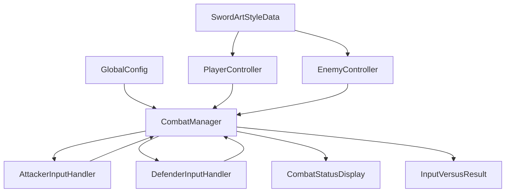

## 아키텍처 개요

### 주요 모듈
- **CombatManager**: 전투 루프/턴 진행/판정 트리거. 싱글톤
- **PlayerController / EnemyController**: 커맨드 선택, 히트 결과 수신
- **AttackerInputHandler / DefenderInputHandler**: 타이밍 입력 기록/판정 이벤트 발행
- **CombatStatusDisplay**: UI 표시(턴/프롬프트/결과)
- **데이터**: `GlobalConfig`, `SwordArtStyleData`, `ActionCommandData`

### 흐름 요약
1) 턴 시작 → 공격자/방어자 핸들러 활성화
2) 커맨드의 `perfectTimings`로 히트 창 구성 → 입력 기록
3) 창 종료 시 `InputVersusResult`가 결과 산출 → UI 표시 → 다음 히트/턴

### 의존 관계(개념)

### 설계 원칙
- 단일 책임, 명시적 상태 전이, 가드/얼리 리턴, 널/범위 방어
- 데이터 구동형(설정/ScriptableObject 중심) + UI는 소비자

### 확장 포인트
- 입력 소스 확장(패드/키/AI), 커맨드 추가, UI 테마/레이아웃 교체, 밸런싱 파라미터 조정

